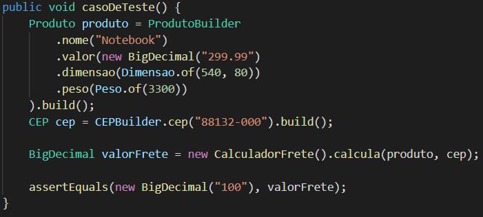
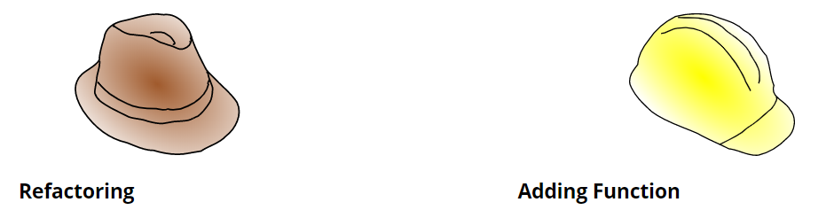
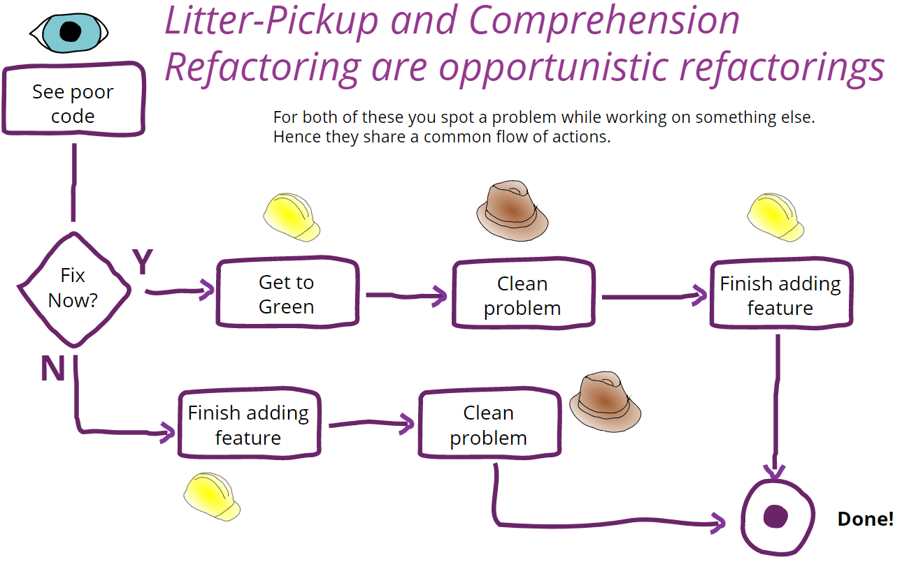

# Refactoring

**Isso é um rascunho, não é a versão final. Alguns pontos pode estar com baixa coerência e poucos explorados, necessitam de melhor revisão**

Esse é um material resultante de uma compilação de minhas experiências sobre refactoring, além de livros, apresentações e blogs de gurus da área de desenvolvimento como [Sandro Mancuso](https://twitter.com/sandromancuso), [Uncle Bob Martin](https://twitter.com/unclebobmartin), [Martin Fowler](https://twitter.com/martinfowler), [Elliotte Harold](https://twitter.com/elharo) e [Michael Feathers](https://twitter.com/mfeathers) sobre o mesmo tema.
O objetivo é mapear técnicas para lidar em todos os estágios da refatoração, desde antes de começar a refatorar, até a etapa pós entrega do código. Não é a missão de explorar profundamente as técnicas definidas aqui, nem ser uma receita de bolo para lidar com código legado, existem materiais que serão linkados que fazem com muito mais detalhamento.
Sinta-se livre para contribuir com esse material.

* [O que é refatoração](#o-que-é-refatoração)
* [Porque refatorar](#porque-refatorar)
* [O que é código legado](#o-que-é-código-legado)
* [Requisitos para refatorar](#requisitos-para-refatorar)
* [Antes de refatorar](#antes-de-refatorar)
* [Dia-a-dia](#dia-a-dia)
* [Estratégia de refatoração](#estratégia-de-refatoração)
* [Apoio a refatoração](#apoio-a-refatoração)
* [Manutenção e pós refatoração](#Manutenção-e-pós-refatoração)

## O que é refatoração

Resumindo é a maneira de alterar a estrutura do código sem alterar o comportamento. Quem não gosta de uma casa limpa e organizada? Viver em um ambiente sujo e bagunçado causa stress, não achamos as coisas que gostariamos e vergonha de trazer alguém para tomar um café. Assim tem que ser com o nosso trabalho: limpo e organizado. Trabalhar com código fonte que é bagunçado e sujo nos causa efeitos parecidos como no exemplo acima. Só que com alguns agravantes, nosso dinheiro depende disso, a empresa depende disso, os nossos clientes dependem disso. Bagunça não encontramos as coisas fáceis, bugs se escondem no meio da sujeira que ficam difíceis de encontrar mesmo depois de inspecionar por horas (debugging) no meio do caos.

## Porque refatorar

Alguns pontos sobre os benefícios de refatorar:
* Menos stress.
* Eliminar problemas de código legado.
* Design simples e elegante.
* Tempo para focar em produto e não em bugs.
* Agilidade no entendimento do código.
* Agilidade em adicioonar novas funcionalidades.

As vantagens são realmente muito atraentes, os pontos acima nos dá velocidade de resposta, facilidade na leitura devido a expressividade do código fonte, tempo para experimentar novas soluções e paz de espírito. 
Mas nada supera uma palavra: economia. Quer ir rápido sendo barato? código legível, clientes pagando por lentidão em adicionar funcionalidade, criação de bugs ou cliente pagando realmente por novas funcionalidades? Equipes resolvendo pilhas e mais pilhas de bugs ou gastando esforços em evolução da arquitetura e funcionalidades?
Os outros itens é basicamente ser um bom profissional, problemas em código acontece, pressão externa acontece, mas há maneiras de amenizar que não cabe a esse documento discutir.

## O que é código legado.

Adicionar um novo código lhe coloca medo de adicionar bug? Pode ser um grande alerta de que você se deparou com código legado, o medo ocorre porque a garantia é baixa, a confiabilidade na integridade é baixa, irá ter que confiar em testes manuais ou testes automatizados furados que existem apenas para cobrir cobertura de código. Muitos definem que código legado é código sem teste automatizado, eu particularmente prefiro a abordagem do Uncle bob e Elliotte Rusty Harold, que dizem que o medo é o indício de código legado, é algo mais primário que nos frea e falta coragem de encarar o código que se deparamos.

Pessoas também defendem que código de pouca expressividade, que carece de contexto, que o desenvolvedor precisa montá-lo em sua cabeça  para entender o que ele quer dizer, é codigo legado. Para possuir esse domínio precisa de tempo de casa, desenvolvedores novos na equipe sempre precisam de desenvolvedores antigos para desvendá-lo.

## Requisitos para refatorar

Os requisitos serão mapeados por níveis de importância para a refatoração de *Indispensável* a *Descartável*, esses níveis foram mapeados de acordo com a minha experiência, caso você não concorde com alguma classificação, não tem problema! Siga seu feeling profissional, segue a lista:

* **Indispensável**
Não é possível refatorar de maneira efetiva sem esse requisito.

* **Altamente recomendável**
Sem o requisito, é passível de gerar baixa performance, entrega com menor valor, etc...

* **Recomendável**
O requisito pode dar apoio em decisão ou gerar dados, mas é possível de ter uma entrega satisfatória sem ele.

* **Descartável**
Esse requisito não faz sentido para a refatoração, avalie 2 vezes antes de utilizar.

### Testes automatizados - Indispensável

Não tem como ter garantia sem testes automatizados, há muita coisa para perder para depender de testes manuais, além de que testes manuais são caros de executar e seres humanos são passíveis de diversas variáveis externas como problemas familiares, financeiros, etc... que podem degradar a qualidade do teste. Teste de unidade se encaixa muito bem pelo baixo nível de teste que se propõe além de ser extremamente barato de executá-lo, milhares de testes são executados em poucos segundos.

### Integração contínua - Indispensável

CI/CD dá a confiança que o sistema continua funcionando mesmo com a limpeza sendo feita, você pode visualizar os passos da pipeline sendo executada, os testes automatizados e deploy nos ambientes de homologação/produção, mesmo caso esqueça de rodar os testes na máquina local, não tem como publicar uma nova versão sem passar todas as etapas sem erro, pois a deploy está automatizado e é o único ponto de publicação.

### IDE - Indispensável

IDEs modernas possuem diversas funcionalidades de refatoração como extração de estrutura: variável, método, classe, constante, etc..., buscar dependência, sugerir melhorias e warning, trabalho que fazendo manualmente podendo adicionar bug ao projeto, IDEs estáveis dá garantia que ao executar alguma ferramenta de refatoração, o comportamento não foi alterado e os testes continuam passando.
Editores de texto como Sublime Text, Visual Studio, VIM, etc... não conheço se possui essas funcionalidades que executam com tanta confiabilidade, se você consegue chegar no mesmo nível de IDEs continue com o seu editor de texto, caso contrário, estude em utilizar uma IDE.

### Ferramenta de análise estática - Altamente recomendável

Ferramentas ajudam no apoio a encontrar vulnerabilidades, code smells, cobertura de testes automatizados, checagem de padrão e entre outos; Atuando como revisores de código automatizado e gerando relatórios sobre o resultado da revisão. Essas ferramentas podem atuar integrado a IDE, editor de texto ou como uma etapa da esteira de código. Nessa última podendo atuar como guardião e impedindo a publicação caso alguma regra definida pela equipe é violada.

Lembre-se que cobertura de código é uma ferramenta de apoio ao desenvolvimento e não uma métrica de gerenciamento, 95% de cobertura de cõdigo significa software bem testado? livre de bugs? não necessariamente, é possível criar testes de unidade que passem pelas linhas descobertas sem que gere asserções adequadas. Caso seja "vendido" essa métrica para a gerência e ocorra um bug, é possível que a gerência pergunte: "Esse bug foi gerado nos 5% sem cobertura?" Qual seria a resposta? Caso seja verdadeiro, haverá uma pressão de adicionar cobertura nesses 5% mesmo que a equipe já tenha adicionado cobertura no bug que foi corrigido, locais virtualmentes inalcançáveis, getters e setters onde o valor é muito pequeno, precisem receber teste de unidade.

Mas o pior caso é caso a resposta seja negativa, a métrica cai por terra, não haverá uma confiabilidade, já que havia testes na linha que apresentou o problema, apesar de que não foram bem escritos, a gerência colocará de escanteio.

### Programação em par - Recomendável

Programação em par ajuda na transmissão de conhecimento, na coletividade do código-fonte e na revisão de código feita durante o processo. Refatorar é uma prática que requer entendimento técnico de boas práticas, trade-offs que podem surgir e visão arquitetural para atender o produto no futuro, todas essas decisões ganham quando há troca de experiências entre os pareados. Não acredito que precisa ser pareado durante todo o ciclo de vida da refatoração, a pessoa que está a frente do desafio que precisa sentir a necessidade e do ganho do valor de ter outro desenvolvedor na empreitada.

### Padrão para arquitetura de testes - Recomendável

Como o código de produção precisa de padrão para ter boa legibilidade, o código de teste também precisa pelo mesmo motivo. Padrão para criação de dublês de teste (mock, dummy, spy, fake, stub, outros...), configuração para execução do teste automatizado, builders para entidades, estrutura de um teste de unidade. Atualmente utilizo essa estrutura para criar meus testes java:

Primeiro corpo do teste segue com a configuração necessária para executar o teste, seguido por um espaço em branco, após a execução da função sendo testada, seguido por um espaço em branco e suas asserções.

### Dedicação a refatoração - Descartável

Refatoração tem que estar no *modus operandi* da equipe, fazer parte do processo de baixo nível do trabalho, atrelado as tarefas do dia-a-dia como incluir novas funcionalidades ou trabalhar em algum bug; Ao se deparar com o código fora do padrão, sem testes, ou remover trade-offs que não fazem mais sentido, deve-se refatorar (lembre-se de realizar commits separado da tarefa, facilita a rastreabilidade e a separação de contexto). Se for visível que o esforço de deixá-lo limpo é maior que o tempo disponível, não se preocupe em finalizar o trabalho, deixe para resolver nas próximas tarefas que atingir o código.

### Avisar o gestor - Descartável

Não avisamos o gestor as estratégias que tomamos em usar algum design pattern específico ou se vamos utilizar composição ao invés de hierarquia entre classes, por que avisar sobre refatoração? Nosso trabalho é entregar produto de qualidade, e qualidade significa manter o código simples, testado, livre de bugs o máximo possível e atendendo as expectativas, caso ele ou ela esteja impedindo, no mínimo estará se comportando de maneira não profissional e amadora.

## Antes de refatorar

Análise estática para gerar insights.
Equipes que tem baixa experiência podem focar em atingir metas quantificativas (obtidos através de ferramentas que geram métricas como violação de regras e padrões), essas mesmas ferramentas apoiam a equipe na evolução sendo um guia para um melhor software. Metas qualificativas como muitas técnicas do clean code, possui um grau de complexidade maior de análise, ferramentas tem maior dificuldade em suportar e precisa um pouco mais de experiência do desenvolvedor em código limpo e a capacidade de fazer trade offs em decisões que serão tomadas.

## TDD

Test driven development ou TDD, não é uma técnica de refatoração, mas compõe na sua essência refatoração de código. Fazendo um resumo bastante superficial é a maneira de desenvolver sistemas escrevendo o teste primeiro e posteriormente o código de produção, os benefícios não vou abordar aqui porque foge do escopo de material, se encontra fácil em uma rápida pesquisa na internet. Vamos focar no seu ciclo, onde a refatoração ocorre.

cíclo TDD: Escreva um teste que falhe -> faça o teste passar (chapéu adicione funcionalidade) -> refatore (chapéu refatoração).

Os 3 ciclos são bem definidos, eles não devem invadir a responsabilidade um do outro, ao tiver na segunda etapa, deve-se escrever o coódigo suficiente para passar, aqui não devemos nos focar em refatorá-lo, não devemos usar o *chapéu da refatoração* (explicação logo abaixo) nessa etapa, como na terceira etapa não devemos em preocupar em adicionar mais funcionalidade, não é o foco, além de ferir o ciclo TDD pulando a etapa de escrever o teste primeiro.

### Vestir o chapéu

"Vestir o chapéu" é uma expressão que significa agir com um determinado mindset, para se manter o foco deve-se manter dividir as tarefas, quando estiver adicionando uma funcionalidade, vista-se o chapéu de "adicionar funcionalidade", quando estiver refatorando, vista-se o chapéu "refatoração". O problema de fazer os dois ao mesmo tempo é a troca de contexto para realizar as duas tarefas ao mesmo tempo, o foco tem que ser dividido, problemas podem ocorrer aí, foco 100% para resolver um problema por vez, criar pequenos commits para cada mudança de chapéu pode ser bom para uma sensação de evolução em ambos os esforços e mantê-los separados.

### Tipos de refatoração

Martin Fowler mapeou 5 tipos de refatoração:

* TDD Refactoring

Como apresentado acima, é a terceira etapa do ciclo do TDD, faz parte do processo de qualquer desenvolvedor que esteja aplicando TDD.

* Litter-Pickup Refactoring

Também conhecido como regra do escoteiro, **sempre deixe o local melhor que quando o visitou**, são refatorações que não são planejadas, decidimos utilizar quando encontramos algo ruim. A proposta não é corrigir todos os problemas, mas resolver alguns dentro de um determinado tempo que seja diluível na tarefa principal. Locais mais visitados são limpos com mais freqüencia e com o tempo os problemas tendem a desaparecer.

* Comprehension Refactoring

Quando lemos assinatura de método, mas o código faz algo diferente ou a mais, variáveis que não sabemos o que significa, condições com inúmeras subcondições, etc... existe uma carga de energia gasta para entendimento; E nessas condições é necessário de um esforço extra, aplicamos comprehension refactoring quando queremos dar o real significado do que o código quer dizer, renomeamos métodos e variáveis, extraímos métodos e usamos nomes que fazem sentido, que o contexto esteja explícito e deixa explícito sua intenção ao invés de escondê-lo.

* Preparatory Refactoring

O famoso *preparar o terreno*, necessário ao checar que o local que será adicionado a nova funcionalidade não a suportará de maneira ideal. Pode requerer algum tempo de planejamento. Para resolver isso usa-se o chapéu de refatoração, refatore até alcançar a qualidade desejável, então mude para o chapéu de adicionar a funcionalidade e continue com a tarefa.

* Planned Refactoring

São tarefas exclusivamente dedicadas a refatoração, essas tarefas ficam visíveis e concorrem com outras tarefas no quesito prioridade,  pessoas de produto podem achar que por causa da existência desse tipo de trabalho o software não está saindo com a qualidade necessária e podem influenciar no nível de prioridade.

* Long-Term Refactoring

Grandes refatorações que geram vários impactos no sistema, como alterar a comunicação entre módulos, mudança de arquitetura e tecnologia. Além de boas habilidades requeridas, forte comunicação entre a equipe evita dores de cabeça, enquanto a refatoração ocorre, funcionalidades ainda estão sendo escritas e precisa ser adaptável a futura realidade.

## Dia-a-dia

No dia-a-dia, resolvendo tarefas recorrentes podemos cair em código que não corresponde com a qualidade esperada (Litter-Pickup Refactoring) ou não é expressivo suficiente (*Comprehension Refactoring*), Martin Fowler chama essa oportunidade de refatoração de *opportunistic refactoring*, o fluxograma extraído do seu slide mostra podemos nos comportar usando TDD e vestir o chapéu para resolver esse problema: 

### Revisão de código e programação pareada.

Como em desenvolvimento de funcionalidade, refatoração também ganha o benefício de um segundo desenvolvedor revisar e discutir a solução proposta. Grandes evoluções podem emergir de uma troca de idéias e propostas de melhoria, é altamente recomendável passar por programação pareada ou revisão de código.

## Estratégia de refatoração

Estratégias adotadas para problemas recorrentes, seguindo por um problema definido e técnicas para resolvê-lo, porém existe algumas técnicas "genéricas" que pode/deve ser aplicada para qualquer tipo de problemas como:

* Clean code

Clean code não é só aplicado em refatoração mas em qualquer etapa do desenvolvimento do código fonte, Uncle bob reuniu um conjunto de boas práticas na escrita de código no livro Clean Code, que a propósito deve ser lido por todos os desenvolvedores.

### Métodos complexos

Na refatoração de método, ir no galho mais profundo pois precisa menos contexto, ao terminar de refotar, checar qual o galho mais profundo que restou e esse ciclo se fecha criando pequenos contextos para cada teste de unidade (Comprehension Refactoring), com o fim da refatoração teremos diversos métodos menores expondo sua intenção melhorando o entendimento, no final com toda a carga de conhecimento adquirido sobre o produto durante a refatoração, pode-se fazer uma segunda rodada de refatoração aplicando comprehension refactoring sobre o código recém refatorado. 
Outro tipo de abordagem irá precisar de entender mais a  em outros casos pode precisar ler o método completo e provavelmente será mais complexo em refatorar.

### Software totalmente legado

A origem de software big ball of mud pode ter diversas fontes: Nível técnico da equipe baixo, pressão, processos de desenvolvimento baixo. Não deve-se julgar as pessoas responsáveis por aquele código, apenas vivendo a época para sentir a cultura da empresa e habilidades dos profissionais para entender como chegou naquele resultado. Gastar energias ofendendo os pais da equipe que gerou não irá deixar o código limpo e livre de bugs, refatoração sim, é a maneira de lidar com o problema.

A primeira ação seria checar se realmente há necessidade de refatorá-lo, se o software apesar de problemático, roda há muito tempo com estabilidade e não tem planejamento para evoluí-lo, não haverá valor ou muito pouco sobre o investimento caso encontre um ou dois bugs que o cliente cairia em uma conbinação muito difícil digna a ganhar na loteria, 

O valor existe então ir para a segunda ação, pensar em qual linha de refatoração irá seguir:

* Refatoração oportunistica (Litter-Pickup Refactoring + comprehension refatoring), 
* Refatoração a longo prazo (long-term refactoring).

Em minha opinião entraria 1 variável para a decisão se tomar para refatoração oportunistica: domínio do sistema. Equipes que possuem o conhecimento do sistema costumam serem os mesmo que o desenvolvem, a decisão de refatorar nesse quesito certamente é uma mudança de paradigma em nível técnico ou cultura da empresa, que agora desejam colocar o software num próximo nível. Essa equipe tem conhecimento no *vespeiro* que irão lidar, dominam gotcha's e possuem o contexto implícito do software chumbados em seus cérebros. Essa é a única realidade que eu vejo que refatoração oportunistica pode ser avaliado como uma abordagem melhor que as outras duas.

Refatoração a longo prazo é o caminho mais usual, poderia ser até uma planned refactoring, mas quando uma equipe possui pouco ou nenhum conhecimento da base de dados, fica difícil conseguir segmentar em refatorações planejadas, o risco é alto de virar refatoração a longo prazo. 

Uma boa estratégia é:

* Focar testes de unidade no core do sistema.
* Mire no caminho principal da aplicação.
* Com uma boa abordagem passe para bordas/periféricos.
* Focar testes automatizados em abrangência e não em detalhes.
* Aumentar a suite de testes ao quebrar os grandes testes de unidade e especializá-los, com suporte de novos testes para outros galhos especialistas.
* Comece pequeno, não abrace o mundo. Escreva um teste por vez e pequenas refatorações, haverá muita aprendizagem nessa jornada e não faça BDUF.

### Módulos altamente acoplados

* Façade

Façade é um design pattern que significa em criar uma interface que simplifica e padroniza a comunicação entre os componentes sob o façade e o mundo externo. Isso possibilita uma serie de vantagens como único ponto de acesso (quando isolado), esconde complexidade, esconde componentes que não precisam expor ao cliente e facilita a configuração na utilização.

Estrangulamento, ou como já ouvi alguns dizendo morte por inanição para o mesmo objetivo, é uma técnica aconselhável para remover uma parte do sistema em detrimento de outra, seja por troca de tecnologia, seja pelo avançado estágio de podridão do código. Com ela também é possível a organização de bordas de módulos.

Caso seja uma reescrita, é possível manter as duas versões rodando em paralelo, intercambeando entre as versões em tempo de execução através de feature toggle, assim, poderá executar testes manuais e executar em cliente com alguma garantia de caso apareça algo inesperado, troque a chave para a utilização do módulo antigo.

### Complexidade

Um excelente livro que apresenta literalmente dezenas de técnicas de refatoração é o Refactoring: improving the design of existing code (2nd edition) do Martin Fowler, considero um livro que precisa estar na mesa do desenvolvedor que lida com código legado e refatorações, existem muitas receitas para problemas cotidianos. Consiga esse livro para ontém e aproveite todo o conhecimento reunido para atacar a complexidade do seu código.

Trago algumas técnicas genéricas que auxiliam na diminuição da complexidade:

* Single responsability principle.
* APIs simples.
* Imutabilidade.
* Renaming.
* Encapsulamento.
* Eliminação da duplicidade.

### Feature envy/Entidades anêmicas

* Encapsulamento.

Feature envy e entidades anêmicas tem problemas similares, apenas em locais diferente, enquanto entidade anêmica se concentra problema no domínio do sistema, feature envy é mais focado em todo o resto.

Eg. Imagine uma entidade profissional que possui apenas atributos e seus métodos de encapsulamento desses atributos, isso é conhecido como entidade anêmica, anêmica de **lógica de domínio**! Quando ela não controla e conhece o seu próprio comportamento e são outras classes ou funções que o fazem. Ao invés de eu perguntar para profissional se o seu cargo é um cargo de diretoria, preciso carregar um serviço (ProfissionalService como exemplo) ou qualquer outro tipo de estrutura de uma camada que não seja de domínio. Os pontos negativos desse problema é lógica de domínio espalhada em camadas fora do domínio, alto acoplamento: caso precise utilizar uma entidade, terá que carregar todo os serviços em volta dessa entidade e o pior pode acontecer, pode acabar duplicando lógica de domínio caso acabe não encontrando algo que já foi implementando julgando que não exista.
No caso de feature envy o problema é parecido, é possível identificar quando uma classe X acaba executando diversos métodos de uma classe Y para obter um determinado resultado, todas as essas operações a classe Y poderia abstrair e a classe X apenas perguntaria pelo resultado. Mais informações sobre feature envy nesses links: <Links> e anemic entities nesses links: <links>
 
A solução costuma ser simples, para resolver esses problemas basta mover ou criar métodos para as classes que deve ser responsável pela lógica.

## Apoio a refatoração

### Medições de código

* Dependência entre estruturas.
  * Design structure matrix (DSM).
  * "Martin’s metrics".

* **Complexidade de algoritmo.**
  
  * Cyclomatic complexity. (Grau de complexidade)
  
Complexidade ciclomática é quantidade de caminhos que o fluxo de um algoritmo pode tomar, é diretamente proporcional pela quantidade de controladores de fluxo o código-fonte possui, quanto mais condições por exemplo, maior é a sua complexidade. Muito útil para identificar a complexidade para montar teste de unidade e a noção de quantidade de testes de unidade para cobrir suas regras.

  * Cognitive Complexity. (Grau de dificuldade de ler e entender o código)
Anos atrás complexidade ciclomática também era utilizado para como um valor quantitativo para apresentar grau de legibilidade de um código, o problema que ela possui alguns problemas (discutir um pouco sobre isso e trazer os exemplos do artigo original).

* Code smell
   * Code churn
   
## Manutenção e pós refatoração

## Bibliografia

### Vídeos
* [Testing and refactoring legacy code - Sandro Mancuso](https://www.youtube.com/watch?v=AUtrEYnm0ts)
* [Unconditional Code - Michael Feathers](https://www.youtube.com/watch?v=AnZ0uTOerUI)
* [Testing Legacy Code - Elliotte Rusty Harold](https://www.youtube.com/watch?v=cjxXv0eifhY)
* Workflows of Refactoring - Martin Fowler: [video](https://www.youtube.com/watch?v=vqEg37e4Mkw) - [slide](https://martinfowler.com/articles/workflowsOfRefactoring/).

### Livros

* Refactoring: Improving the Design of Existing Code (2nd Edition) - Martin Fowler
* Clean code - Robert C. Martin (Uncle Bob)
* The Software Craftsman: Professionalism, Pragmatism, Pride - Sandro Mancuso
